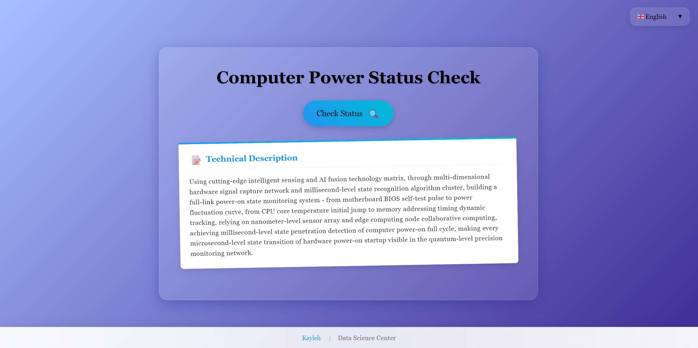

# check_computer_on

English | [Français](docs/README.fr.md) | [Русский](docs/README.ru.md) | [日本語](docs/README.ja.md) | [简体中文](docs/README.zh.md)

[](https://opensource.org/licenses/MIT)
[](http://makeapullrequest.com)
[](https://github.com/yourusername/check_computer_on/graphs/commit-activity)
[](https://pcstatus.kayleh.top)

## ✨ Features

- 🚀 Real-time computer power status detection
- 🌈 Beautiful and modern UI design
- 🌍 Multi-language support (EN, FR, RU, JA, ZH)
- 🎉 Interactive celebration effects
- 📱 Responsive design for all devices
- ⚡ Fast and lightweight

## 🎯 Demo

[Live Demo](https://pcstatus.kayleh.top/)



## 🛠️ Technology Stack

- HTML5
- CSS3
- JavaScript
- Canvas Confetti (Confetti effect implementation)

## 🚀 Quick Start

1. Clone the repository:
```bash
git clone https://github.com/yourusername/check_computer_on.git
```

2. Open `index.html` in your browser

## 📝 Usage

Simply click the "Check Status" button to verify your computer's power status. The system will display a celebratory message if your computer is powered on.

## 🤝 Contributing

Contributions, issues, and feature requests are welcome! Feel free to check the [issues page](https://github.com/yourusername/check_computer_on/issues).

1. Fork the Project
2. Create your Feature Branch (`git checkout -b feature/AmazingFeature`)
3. Commit your Changes (`git commit -m 'Add some AmazingFeature'`)
4. Push to the Branch (`git push origin feature/AmazingFeature`)
5. Open a Pull Request

## 📄 License

This project is licensed under the MIT License - see the [LICENSE](LICENSE) file for details.

## 👥 Authors

- **Kayleh** - *Initial work* - [Website](https://www.kayleh.top)

## 🙏 Acknowledgments

- Thanks to all contributors who have helped this project grow
- Special thanks to the open-source community for their invaluable tools and resources

---

⭐️ From [Kayleh](https://www.kayleh.top) 