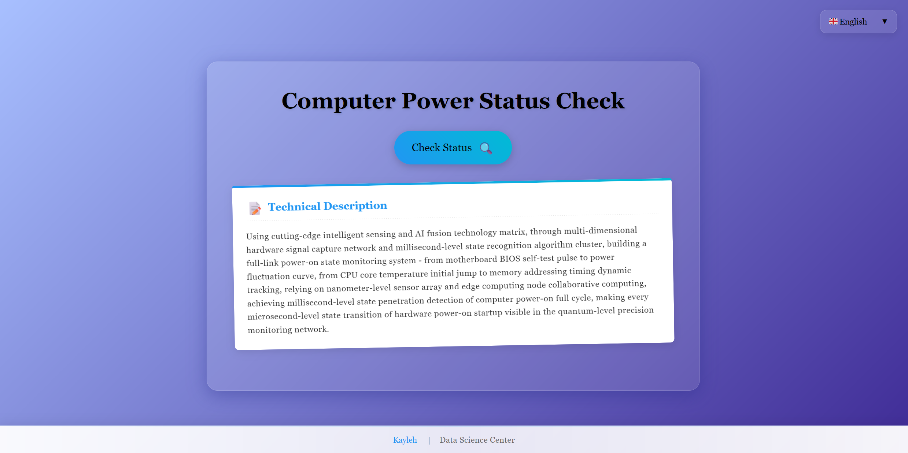

# check_computer_on

[English](../README.md) | [Français](README.fr.md) | [Русский](README.ru.md) | [日本語](README.ja.md) | 简体中文

[](https://opensource.org/licenses/MIT)
[](http://makeapullrequest.com)
[](https://github.com/yourusername/check_computer_on/graphs/commit-activity)
[](https://pcstatus.kayleh.top)

## ✨ 功能特点

- 🚀 实时电脑开机状态检测
- 🌈 美观现代的 UI 设计
- 🌍 多语言支持 (EN, FR, RU, JA, ZH)
- 🎉 互动庆祝效果
- 📱 响应式设计，支持所有设备
- ⚡ 快速轻量级

## 🎯 演示

[在线演示](https://pcstatus.kayleh.top/)



## 🛠️ 技术栈

- HTML5
- CSS3
- JavaScript
- Canvas Confetti (五彩纸屑特效实现)

## 🚀 快速开始

1. 克隆仓库：
```bash
git clone https://github.com/yourusername/check_computer_on.git
```

2. 在浏览器中打开 `index.html`

## 📝 使用方法

只需点击"检测状态"按钮即可验证您的电脑开机状态。如果您的电脑处于开机状态，系统将显示庆祝信息。

## 🤝 参与贡献

欢迎提交贡献、问题和功能请求！请查看 [issues 页面](https://github.com/yourusername/check_computer_on/issues)。

1. Fork 本仓库
2. 创建您的特性分支 (`git checkout -b feature/AmazingFeature`)
3. 提交您的更改 (`git commit -m '添加一些特性'`)
4. 推送到分支 (`git push origin feature/AmazingFeature`)
5. 开启一个 Pull Request

## 📄 许可证

本项目采用 MIT 许可证 - 查看 [LICENSE](../LICENSE) 文件了解详情。

## 👥 作者

- **Kayleh** - *初始工作* - [个人网站](https://www.kayleh.top)

## 🙏 致谢

- 感谢所有帮助这个项目成长的贡献者
- 特别感谢开源社区提供的宝贵工具和资源

---

⭐️ 来自 [Kayleh](https://www.kayleh.top)